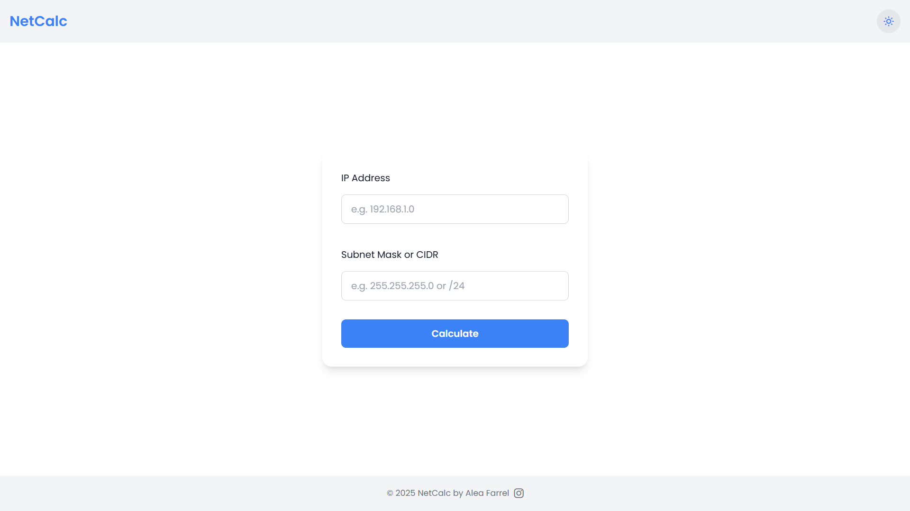
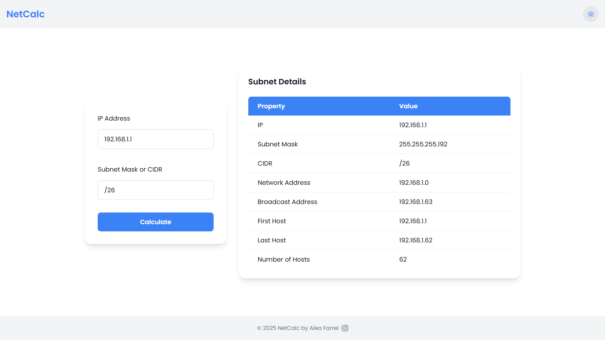
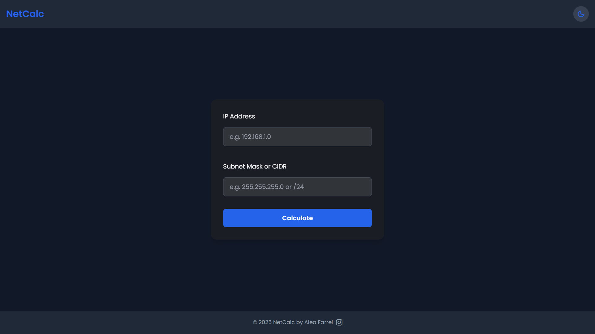
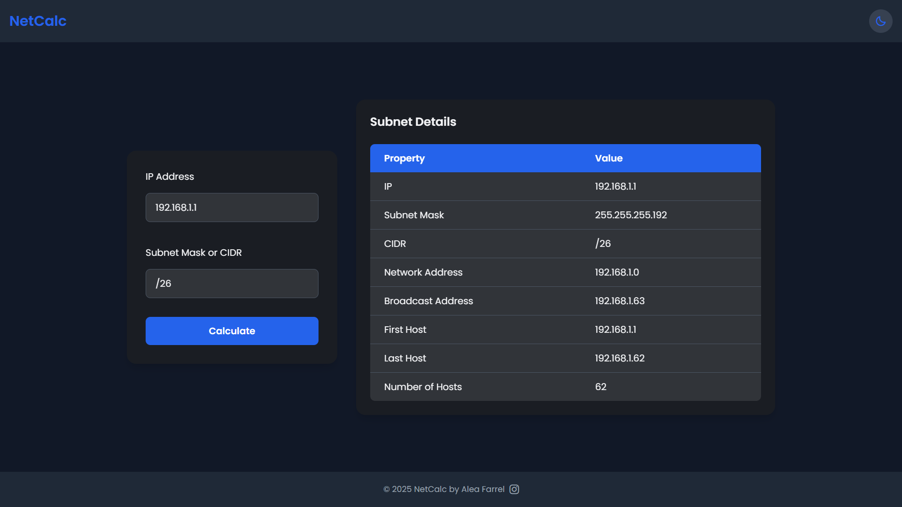

# IP Calculator

## About App

**Blazing-fast and lightweight** — this containerized IP calculator is powered entirely by **Vanilla JavaScript**. It enables you to perform essential IP address operations such as IP conversions and subnet calculations with ease.

Everything is packaged inside a **Docker container**, allowing you to run it effortlessly without complex setup or installation.

## Requirements

To run this application, the only requirement is:

- [Docker](https://docs.docker.com/get-docker/)

## Usage

You can run the IP Calculator with just a few simple steps using Docker.

---

### Using Docker CLI

#### 1. Pull Image from Docker Hub (if available)

```bash
docker pull aleafarrel/netcalc:1.0
```

#### 2. Create the Container

```bash
docker container create --name netcalc -p 8080:80 aleafarrel/netcalc:1.0
```

This will create the container and expose the app on port **8080** of your local machine.

#### 2. Run the Container

```bash
docker start netcalc
```

#### 3. Access the Application

Open your browser and go to:

```
http://localhost:8080
```

---

### Using Docker Desktop

#### 1. Pull the Image

- Open **Docker Desktop**
- Navigate to **Images**
- Click **Pull**
- Enter: `aleafarrel/netcalc:1.0`

#### 2. Run the Container

- After pulling, find the image in Docker Desktop
- Click **Run**
- Configure port mapping:
  - Container port: `80`
  - Host port: `8080`

#### 3. Access the Application

Open your browser and visit:

```
http://localhost:8080
```

---

## Preview

Here’s an example screenshot of the app running:

### Light Mode





### Dark Mode





---

## Contribution

This project was built purely out of hobby and curiosity. I'm not a professional developer, so if you have any feedback, ideas, or improvements — feel free to contribute!

Every suggestion or contribution is genuinely appreciated 🙏

---

## License

This project is open source and made entirely out of personal passion. I'm not a professional programmer — in fact, I may not even know how to code properly.  
Feel free to use, modify, or distribute it as you wish.  
I hope you enjoy using it, and if you do, feel free to reach out via Instagram DM!